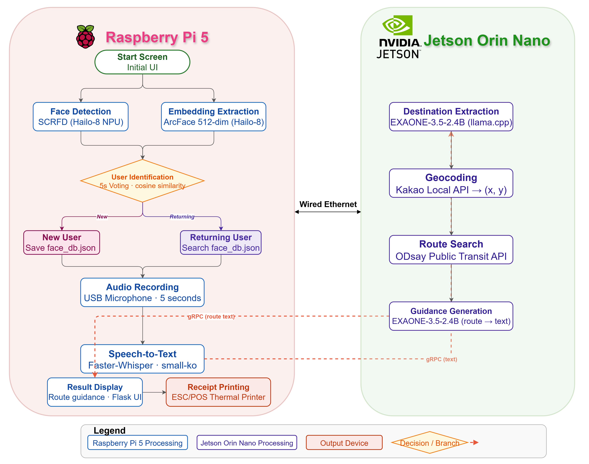

# On-ieum

### Integrated Public Transportation AIoT System for the Digitally Vulnerable

#### Capstone Project, Kangwon National University; Department of Electronic and Semiconductor Engineering

 

---

## Table of Contents

1. [Overview](#overview)
2. [Motivation](#motivation)
3. [On-Ieum Pipeline](#on-ieum-pipeline)
4. [Physical Custom Hardware](#physical-custom-hardware)
5. [Getting Started](#getting-started)
6. [Demo Video](#demo-video)
7. [References](#references)
8. [Contact Information](#contact-information)

---

## Overview

We developed Integrated AIoT systems "On-Ieum" for guiding transportations without requiring smartphone.
The On-Ieum consist of multiple AI models such as Face Recognition Models, Speech-to-Text Models, and On-Device LLM that inference only Edge Devices(Raspberry Pi 5 and Jetson Orin Nano).

---

## Motivation

In modern world, utilizing smart-phone abilities are important and basic skills for living many areas. Especially, using public transit networks such as Buses, Subways, and Trains. However, the main center of cities are highly dense and complex. For example, Seoul that Capital of South Korea is the one of the dense areas. The Seoul subways and buses system provide many public transit networks and it's highly complex. Even younger people that familiar with smartphone, it is quite difficult using Seoul's transit networks. The digitally vulnerable people will be more complex than younger people. To address this, we develop Guided Transportation AIoT System that does not require Smartphone, it's called "On-Ieum".

# Meaning of On-Ieum

The On-Ieum word means could explain two sperate ways. The "On" means Warm-Hearts and The "Ieum" means Connection in Korean.
Overall, we builds the AIoT transportation systems to contribute warm hearts connection with the digitally vulnerable people.

---

## On-Ieum Pipeline

### System Architecture

- Hardware : [Raspberry Pi 5 (8GB)](https://www.raspberrypi.com/products/raspberry-pi-5/) with [AI HAT+(Hailo-8 NPU)](https://www.raspberrypi.com/documentation/accessories/ai-hat-plus.html) [Jetson Orin Nano (8GB)](https://www.nvidia.com/en-us/autonomous-machines/embedded-systems/jetson-orin/nano-super-developer-kit/)
- Face Recognition Model : [SCRFD-10G (at Hailo-8 NPU)](https://github.com/deepinsight/insightface/blob/master/detection/scrfd/README.md)
- Face Embedding Model : [ArcFace MobileFaceNet (at Hailo-8 NPU)](https://arxiv.org/pdf/1804.07573)
- Speech-to-Text Model : [Faster-Whisper whisper-small-ko (at Raspberry Pi 5 CPU)](https://huggingface.co/SungBeom/whisper-small-ko)
- On-Device LLM : [LG EXAONE 3.5 2.4B-Q4 (at Jetson Orin Nano)](https://huggingface.co/LGAI-EXAONE/EXAONE-3.5-2.4B-Instruct)
- Public Transport API : [Kakao Map API for extracting the destination coordinates](https://apis.map.kakao.com/) and [ODsay Lab for guiding to the destination](https://lab.odsay.com/)
-  Peripherals : [Raspberry Pi Camera](https://www.raspberrypi.com/products/camera-module-3/) and Microphone(Britz BE-STM300)
  
---

## Getting Started 

## Physical Custom Hardware

---

## Demo Video

---

## References

---

## Contact Information

If you need to reach this project or have questions,

Technical Leader : Dongjun Kim (dongjun.kim.eecs@gmail.com)

---

**Kangwon National University · Capstone Project · 2025**

